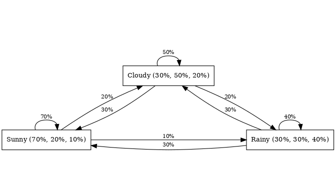

**Concept: Markov Process**

A Markov process, sometimes called a Markov chain, is like a board game where each space on the board is a 'state', and the roll of the dice that moves you from one space to another is the 'transition'. The unique thing about this game is that your next move only depends on where you currently are, not how you got there.

**Follow-up Questions:**

1. Can you tell me more about how a Markov process works?
2. What exactly do you mean by 'states' and 'transitions' in a Markov process?
3. Could you give me a real-world example of a Markov process?

**Answers:**

1. Imagine you're playing a game of Monopoly. You're currently on 'Baltic Avenue'. The game's rules and the roll of your dice will determine where you move next - that's the essence of a Markov process. In this process, you define all possible locations (states) on the board and the likelihood (probabilities) of moving from one to another. Importantly, it doesn't matter if you landed on 'Baltic Avenue' from 'Mediterranean Avenue' or 'Park Place', your next move will only depend on you being on 'Baltic Avenue'.

2. In a Markov process, 'states' are the different places or situations your game piece (or system) can be. 'Transitions' are the possible moves you can make from one place to another. Every state has its own 'transition probabilities', which are the odds that you'll move from your current location to another one. These probabilities are often organized into a 'transition matrix', where each entry shows the likelihood of moving from one state to another.

3. Think about predicting weather as a Markov process. Let's say we have three states: sunny, cloudy, and rainy. The transition probabilities might look like this:

   - If it's sunny today, there's a 70% chance it'll be sunny tomorrow, 20% chance for clouds, and 10% chance for rain.
   - If it's cloudy today, there's a 50% chance it'll stay cloudy, a 30% chance for sun, and a 20% chance for rain.
   - If it's rainy today, there's a 40% chance for more rain, a 30% chance for sun, and a 30% chance for clouds.

   By using this Markov process, we can estimate tomorrow's weather based only on today's weather.

   

**Summary:**

In essence, a Markov process is like a game of chance where each move depends only on your current location, not how you arrived there. It's a useful mathematical model in many fields, including predicting the weather, analyzing stock market trends, and understanding human language.

**See also:**

- [Hidden Markov Model](?concept=hidden+markov+model&specialist_role=ML+Engineer&target_audience=Manager+without+much+technical+background): This is a slightly trickier version of our game where the actual states are hidden, and we can only see the results of being in those states.
- [Reinforcement Learning](?concept=reinforcement+learning&specialist_role=ML+Engineer&target_audience=Manager+without+much+technical+background): A learning method where our game-playing agent learns the best moves in the game over time by exploring and getting rewarded or penalized. Markov decision processes play a big part in this.
